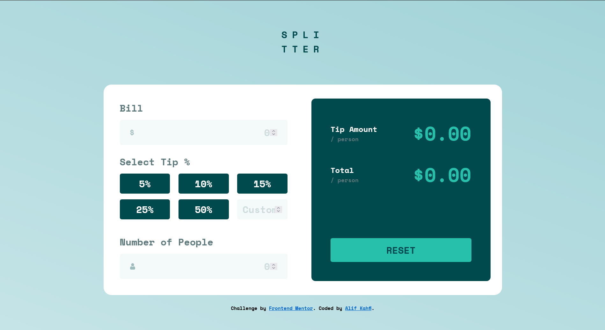

# Frontend Mentor - Tip calculator app solution

This is a solution to the [Tip calculator app challenge on Frontend Mentor](https://www.frontendmentor.io/challenges/tip-calculator-app-ugJNGbJUX). Frontend Mentor challenges help you improve your coding skills by building realistic projects.

## Table of contents

- [Overview](#overview)
  - [The challenge](#the-challenge)
  - [Screenshot](#screenshot)
  - [Links](#links)
- [My process](#my-process)
  - [Built with](#built-with)
  - [What I learned](#what-i-learned)
- [Author](#author)

## Overview

### The challenge

Users should be able to:

- View the optimal layout for the app depending on their device's screen size
- See hover states for all interactive elements on the page
- Calculate the correct tip and total cost of the bill per person

### Screenshot

### Links

- Solution URL: [Frontend Mentor Solution](https://www.frontendmentor.io/solutions/tip-calculator-app-main-using-html-scss-and-vanilla-javascript-KXCwblJj24)
- Live Site URL: [Live Site Using Netlify](https://darling-nougat-b807ba.netlify.app/)

## My process

### Built with

- Semantic HTML5 markup
- [SASS](https://sass-lang.com/) - Preprocessor css
- Flexbox
- Vanilla Javascript

### What I learned

What I learned about this challenge is how to find the logic to show the final result of the calculator. Also I use the flexbox method to make the tip buttons.

## Author

- Instagram - [alifkm](https://www.instagram.com/alifkm/)
- Frontend Mentor - [Alifkm](https://www.frontendmentor.io/profile/Alifkm)
- Twitter - [alifkahfi10](https://twitter.com/AlifKahfi10?t=nxZrhm9DfsdiNFUcbeGSZA&s=06)